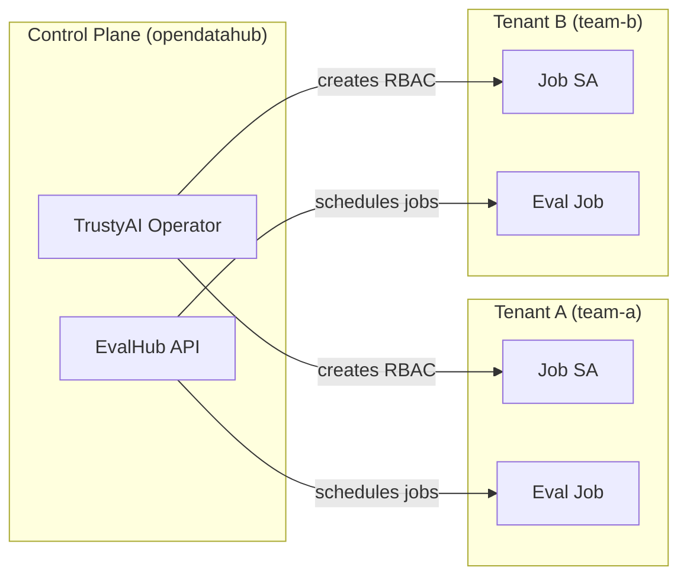
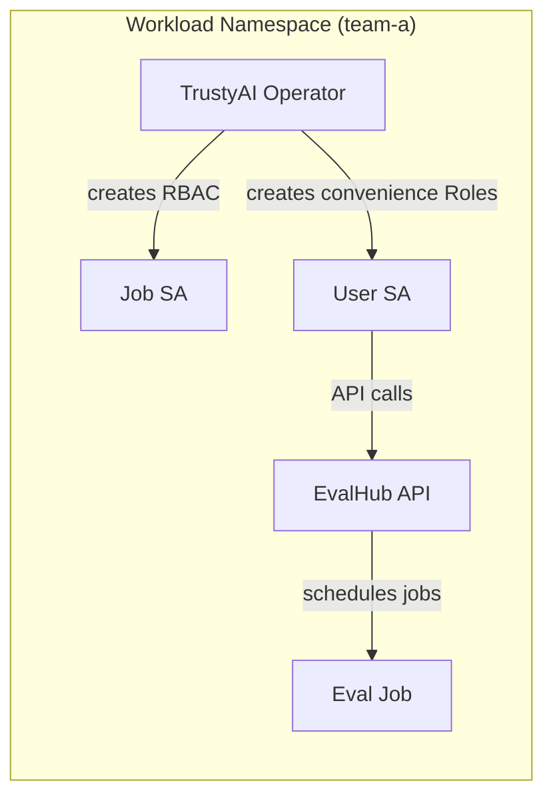
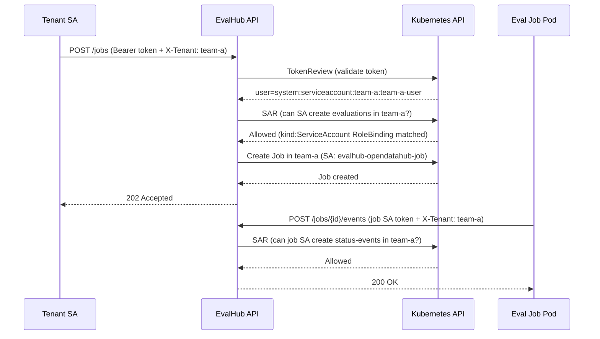
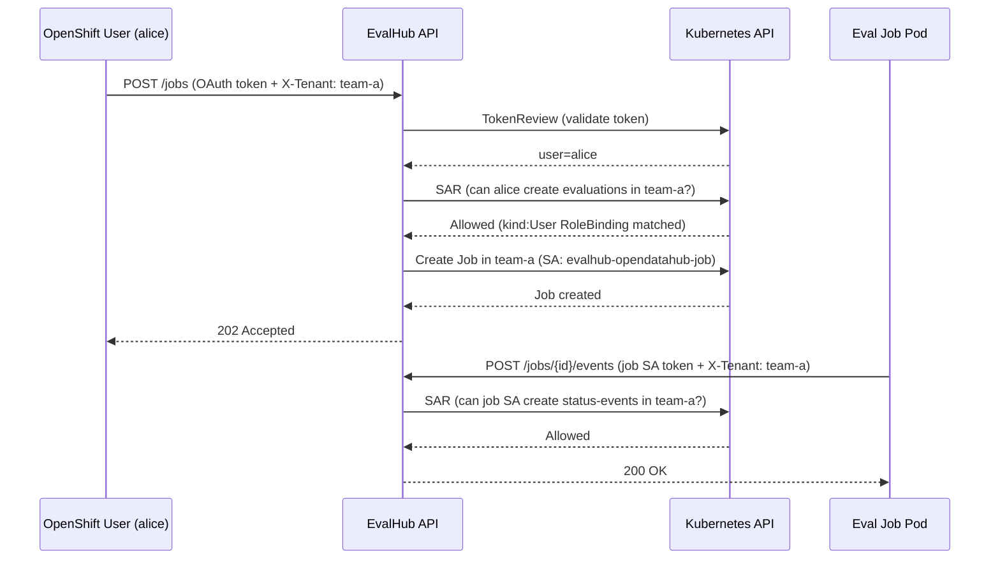
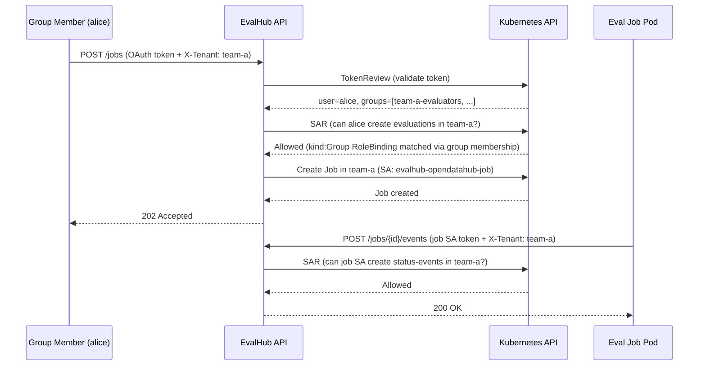

import { LinkCard, CardGrid, Tabs, TabItem } from '@astrojs/starlight/components';

EvalHub uses Kubernetes namespaces as tenant boundaries. Each tenant operates in its own namespace, and access is enforced through Kubernetes RBAC via SubjectAccessReview (SAR) checks.

The TrustyAI Operator controls deployment behaviour via `spec.tenancy` on the EvalHub custom resource. Two modes are available:

| | `multi` (default) | `single` |
|---|---|---|
| EvalHub placement | Control-plane namespace (e.g. `opendatahub`) | Workload namespace |
| Tenant discovery | Label `evalhub.trustyai.opendatahub.io/tenant` on namespaces | None — serves own namespace only |
| Cross-namespace RBAC | Operator provisions job SA + RoleBindings per tenant | Not performed |
| Convenience Roles | Not created | `evalhub-tenant-admin`, `evalhub-user`, admin binding |
| InvalidPlacement guard | Yes — cannot deploy in tenant-labelled NS | No — may deploy anywhere |
| Database | PostgreSQL recommended | SQLite acceptable for dev/small teams |

The core principle in both modes is: **namespace = tenant = MLFlow workspace**.

## Topologies

<Tabs>
<TabItem label="Multi-tenancy">

One EvalHub instance in a control-plane namespace serves multiple tenant namespaces.



</TabItem>

<TabItem label="Single-tenancy">

EvalHub runs in the same namespace as the workloads it serves.



</TabItem>
</Tabs>

## How tenant isolation works

1. **Authentication** -- Bearer tokens are validated via the Kubernetes TokenReview API. The token can belong to a ServiceAccount, an OpenShift User, or a member of an OpenShift Group — EvalHub treats all identically at this stage.
2. **Authorisation** -- Every API request includes an `X-Tenant` header specifying the target namespace. EvalHub runs a SAR check: _"can this principal perform this action in that namespace?"_
3. **Data isolation** -- All database queries are filtered by `tenant_id`
4. **Job isolation** -- Evaluation jobs run in the tenant namespace with a scoped ServiceAccount

:::note[Tenant ID and user identity are independent]
The tenant is always determined by the `X-Tenant` request header — **not** by the identity in the token. A ServiceAccount has a home namespace, but EvalHub does not use it. A real OpenShift User or Group member has no namespace at all. In all cases the caller must supply `X-Tenant` explicitly, and a matching RoleBinding (for the User, ServiceAccount, or Group) must exist in that namespace.
:::

## Authorisation model

EvalHub uses an embedded SAR authoriser. The auth config (`config/auth.yaml`) maps API endpoints to Kubernetes resource attributes:

| Endpoint | Resource | Verb | Namespace source |
|----------|----------|------|------------------|
| `POST /api/v1/evaluations/jobs` | `evaluations` | `create` | `X-Tenant` header |
| `GET /api/v1/evaluations/jobs` | `evaluations` | `get` | `X-Tenant` header |
| `POST /api/v1/evaluations/jobs/*/events` | `status-events` | `create` | `X-Tenant` header |
| `* /api/v1/evaluations/collections` | `collections` | _(from HTTP method)_ | `X-Tenant` header |
| `* /api/v1/evaluations/providers` | `providers` | _(from HTTP method)_ | `X-Tenant` header |

For `POST /api/v1/evaluations/jobs`, two additional SAR checks are performed for MLFlow access (`mlflow.kubeflow.org/experiments` with `create` and `get` verbs).

### Request flow

The flow is identical for all principal types. The only difference is what the TokenReview returns and which subject kind is matched in the RoleBinding.

<Tabs>
<TabItem label="ServiceAccount">



</TabItem>

<TabItem label="OpenShift User">



</TabItem>

<TabItem label="OpenShift Group">



</TabItem>
</Tabs>

Note that the job pod always runs as the operator-provisioned job ServiceAccount (e.g. `evalhub-opendatahub-job`), regardless of whether the submitter was a User, Group member, or a ServiceAccount.

## RBAC reference — ClusterRoles

The operator installs these ClusterRoles cluster-wide. Mode-specific Role and RoleBinding details are documented on the setup pages linked below.

| ClusterRole | Purpose | Key permissions |
|-------------|---------|-----------------|
| `evalhub-auth-reviewer-role` | Token and SAR validation | `tokenreviews`, `subjectaccessreviews` |
| `evalhub-jobs-writer` | Create evaluation jobs | `batch/jobs` (create, delete) |
| `evalhub-job-config` | Manage job config | `configmaps` (create, get, update, delete) |
| `evalhub-providers-access` | Providers endpoint SAR | `providers` (get) |
| `evalhub-collections-access` | Collections endpoint SAR | `collections` (get) |
| `evalhub-mlflow-access` | API server MLFlow access | `experiments` (create, get, list, update, delete) |
| `evalhub-mlflow-jobs-access` | Job pod MLFlow access | `experiments` (create, get, list) |

:::note[Virtual resources]
The SAR targets (`evaluations`, `collections`, `providers`, `status-events`) are virtual — they don't correspond to actual Kubernetes API resources. EvalHub uses them to enforce fine-grained access control via the Kubernetes authorisation API.
:::

## Mode switching

You can change `spec.tenancy` on a running EvalHub instance. The operator reconciles the difference automatically:

| Transition | Operator behaviour |
|---|---|
| `single` → `multi` | Removes convenience Roles; provisions cross-namespace RBAC in tenant-labelled namespaces |
| `multi` → `single` | Cleans up cross-namespace resources; creates convenience Roles in the instance namespace |

:::caution[InvalidPlacement]
A **multi-tenant** instance placed in a namespace carrying the `evalhub.trustyai.opendatahub.io/tenant` label enters `Error` phase with reason `InvalidPlacement`. Fix by removing the tenant label from that namespace or switching to `spec.tenancy: single`.
:::

## Troubleshooting

### 403 Forbidden on API calls

The SAR check is failing. Verify:

1. The `X-Tenant` header matches a namespace where the principal has a RoleBinding
2. The Role includes the correct resources and verbs
3. The RoleBinding `subjects[].kind` matches the principal type (`ServiceAccount`, `User`, or `Group`)

<Tabs>
<TabItem label="ServiceAccount">

```bash
oc auth can-i create evaluations.trustyai.opendatahub.io \
  -n team-a \
  --as=system:serviceaccount:team-a:team-a-user -v=6
```

</TabItem>

<TabItem label="OpenShift User">

```bash
oc auth can-i create evaluations.trustyai.opendatahub.io \
  -n team-a \
  --as=alice -v=6
```

Also confirm the RoleBinding subject kind is `User` and has no `namespace` field:

```bash
oc get rolebinding evalhub-evaluator-binding -n team-a -o yaml | grep -A5 subjects
```

</TabItem>

<TabItem label="OpenShift Group">

```bash
oc auth can-i create evaluations.trustyai.opendatahub.io \
  -n team-a \
  --as=alice --as-group=team-a-evaluators -v=6
```

If the SAR check passes with `--as-group` but real requests still fail:

1. **Token doesn't include group claims** -- The user must re-login (`oc login`) after being added to the group. Existing OAuth tokens may not include the new group membership.
2. **Verify group membership:**

    ```bash
    oc get group team-a-evaluators -o jsonpath='{.users[*]}'
    ```

3. **Confirm the RoleBinding subject kind is `Group`:**

    ```bash
    oc get rolebinding evalhub-evaluator-group-binding -n team-a -o yaml | grep -A5 subjects
    ```

</TabItem>
</Tabs>

### Missing `X-Tenant` header

All evaluation API requests require the `X-Tenant` header, even in single-tenancy mode where the tenant is always the EvalHub instance namespace. Requests without the header are rejected.

## Setup guides

<CardGrid>
  <LinkCard title="Multi-Tenancy" href="/architecture/multi-tenancy/" description="Deploy a shared EvalHub in a control-plane namespace and serve multiple tenant namespaces." />
  <LinkCard title="Single-Tenancy" href="/architecture/single-tenancy/" description="Deploy EvalHub directly in a workload namespace for a single team or project." />
</CardGrid>
