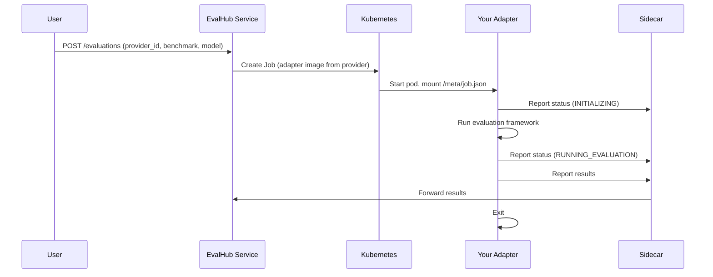

import { Steps, Tabs, TabItem } from '@astrojs/starlight/components';

EvalHub follows a **Bring Your Own Framework (BYOF)** model. Any evaluation framework
can be plugged in by writing a thin adapter, packaging it as a container image, and
registering it as a **provider** through the REST API. This guide walks through the
end-to-end process on an OpenShift cluster.

```
EvalHub Service → (JobSpec via ConfigMap) → Your Adapter Container → Your Evaluation Framework
```

## Prerequisites

- An OpenShift cluster with EvalHub installed
  (see [Installation](/getting-started/installation/) and [OpenShift Setup](/deployment/openshift-setup/)).
- `oc` or `kubectl` configured to access the cluster.
- A container registry accessible from the cluster
  (e.g. `quay.io`, an internal OpenShift registry, or any OCI-compatible registry).
- Python 3.9+ for adapter development.

## How it works

When an evaluation runs, EvalHub creates a Kubernetes **Job** pod with three
containers:

| Container | Source | Role |
|-----------|--------|------|
| **adapter** | Your image | Runs the evaluation framework |
| **sidecar** | Platform | Proxies status updates, results, and OCI artifacts back to EvalHub |
| **init** (optional) | Platform | Loads test data from S3, PVC, or Git before the adapter starts |

Your adapter receives a `JobSpec` via a ConfigMap mounted at `/meta/job.json`.
It contains everything needed to run the evaluation: the benchmark ID, model URL
and name, parameters, and callback URLs. The adapter reads this spec, executes
the framework, reports status through the sidecar, and exits.



## Step 1 — Write the adapter

Install the SDK:

```bash
pip install eval-hub-sdk
```

Create a Python class that extends `FrameworkAdapter`. The only method you need
to implement is `run_benchmark_job()`:

```python
# my_adapter.py
from evalhub.adapter import (
    FrameworkAdapter,
    JobSpec,
    JobCallbacks,
    JobResults,
    JobStatus,
    JobPhase,
    JobStatusUpdate,
    EvaluationResult,
)


class MyAdapter(FrameworkAdapter):
    def run_benchmark_job(
        self, config: JobSpec, callbacks: JobCallbacks
    ) -> JobResults:
        callbacks.report_status(
            JobStatusUpdate(status=JobStatus.RUNNING, phase=JobPhase.INITIALIZING)
        )

        # --- Load your framework and data ---
        callbacks.report_status(
            JobStatusUpdate(status=JobStatus.RUNNING, phase=JobPhase.LOADING_DATA)
        )
        benchmark = load_benchmark(config.benchmark_id)
        model = connect_to_model(config.model.url, config.model.name)

        # --- Run evaluation ---
        callbacks.report_status(
            JobStatusUpdate(
                status=JobStatus.RUNNING, phase=JobPhase.RUNNING_EVALUATION
            )
        )
        output = run_evaluation(
            benchmark,
            model,
            num_examples=config.num_examples,
            **config.parameters,
        )

        # --- Post-process ---
        callbacks.report_status(
            JobStatusUpdate(status=JobStatus.RUNNING, phase=JobPhase.POST_PROCESSING)
        )

        return JobResults(
            id=config.id,
            benchmark_id=config.benchmark_id,
            benchmark_index=config.benchmark_index,
            model_name=config.model.name,
            results=[
                EvaluationResult(
                    metric_name="accuracy",
                    metric_value=output["accuracy"],
                    metric_type="float",
                )
            ],
            num_examples_evaluated=output["count"],
            duration_seconds=output["duration"],
        )
```

### Entrypoint script

The entrypoint wires the adapter to the SDK's `DefaultCallbacks`, which handle
sidecar communication automatically:

```python
# entrypoint.py
from my_adapter import MyAdapter
from evalhub.adapter import DefaultCallbacks

adapter = MyAdapter()
callbacks = DefaultCallbacks.from_adapter(adapter)

results = adapter.run_benchmark_job(adapter.job_spec, callbacks)
callbacks.report_results(results)

print(f"Job {results.id} completed — score: {results.overall_score}")
```

### JobPhase lifecycle

Every adapter must report phases in order. The server validates the sequence:

| Phase | When to emit |
|-------|-------------|
| `INITIALIZING` | Start of `run_benchmark_job` |
| `LOADING_DATA` | Before any data I/O |
| `RUNNING_EVALUATION` | Before the main workload |
| `POST_PROCESSING` | After the framework finishes |
| `PERSISTING_ARTIFACTS` | Only when OCI exports are configured |
| `COMPLETED` | Sent automatically by `report_results()` — do not emit manually |

### Optional: OCI artifact persistence

If the evaluation is configured with OCI exports, persist results as an OCI
artifact:

```python
from evalhub.adapter import OCIArtifactSpec

oci_artifact = None
oci_exports = config.exports.oci if config.exports else None
if oci_exports is not None:
    callbacks.report_status(
        JobStatusUpdate(
            status=JobStatus.RUNNING, phase=JobPhase.PERSISTING_ARTIFACTS
        )
    )
    oci_artifact = callbacks.create_oci_artifact(
        OCIArtifactSpec(
            files_path=results_dir,
            coordinates=oci_exports.coordinates,
        )
    )
```

### Optional: EvalCard and Environment Card

Attach evaluation disclosure metadata for transparency:

```python
from evalhub.adapter import EvalCardMetadata, EnvironmentCardMetadata

env_card = EnvironmentCardMetadata.capture(
    framework_name="my-framework",
    framework_version="1.0.0",
)

eval_card = EvalCardMetadata(
    modalities_input=["text"],
    modalities_output=["text"],
    languages=["en"],
)

results = JobResults(..., eval_card=eval_card, env_card=env_card)
```

If you omit `env_card`, the SDK auto-captures a best-effort Environment Card
from the runtime (Python version, OS, GPU info, installed packages).

## Step 2 — Containerize the adapter

```dockerfile
FROM registry.access.redhat.com/ubi9/python-312

WORKDIR /app

COPY requirements.txt .
RUN pip install --no-cache-dir -r requirements.txt

COPY my_adapter.py entrypoint.py ./

CMD ["python", "entrypoint.py"]
```

Where `requirements.txt` includes at minimum:

```text
eval-hub-sdk
# your framework dependencies
```

Build and push the image:

<Tabs>
<TabItem label="Podman">
```bash
podman build -t quay.io/myorg/my-adapter:v1.0 .
podman push quay.io/myorg/my-adapter:v1.0
```
</TabItem>
<TabItem label="Docker">
```bash
docker build -t quay.io/myorg/my-adapter:v1.0 .
docker push quay.io/myorg/my-adapter:v1.0
```
</TabItem>
</Tabs>

:::tip
If your cluster uses an internal registry, push the image there and reference it
by its internal URL in the provider config.
:::

## Step 3 — Register the provider

Call `POST /api/v1/evaluations/providers` with your provider configuration. The
key fields:

| Field | Required | Description |
|-------|----------|-------------|
| `name` | Yes | Provider name |
| `runtime.k8s.image` | Yes | Your adapter container image |
| `runtime.k8s.entrypoint` | Yes | Container command |
| `benchmarks` | Yes | Benchmarks your adapter supports |
| `runtime.k8s.cpu_request` | No | CPU request (default: `250m`) |
| `runtime.k8s.memory_request` | No | Memory request (default: `512Mi`) |
| `runtime.k8s.gpu` | No | GPU resource, count, and node selector |
| `runtime.k8s.env` | No | Environment variables for the adapter |
| `runtime.k8s.image_pull_policy` | No | `if_not_present` (default) or `always` |

<Tabs>
<TabItem label="curl">
```bash
curl -s -X POST "${EVALHUB_URL}/api/v1/evaluations/providers" \
  -H "Content-Type: application/json" \
  -H "Authorization: Bearer ${TOKEN}" \
  -d '{
  "name": "my-custom-framework",
  "title": "My Custom Evaluation Framework",
  "description": "Custom adapter for my internal evaluation suite",
  "tags": ["custom", "nlp"],
  "runtime": {
    "k8s": {
      "image": "quay.io/myorg/my-adapter:v1.0",
      "entrypoint": ["python", "entrypoint.py"],
      "cpu_request": "500m",
      "memory_request": "1Gi",
      "cpu_limit": "2",
      "memory_limit": "4Gi",
      "image_pull_policy": "always"
    }
  },
  "benchmarks": [
    {
      "id": "my-accuracy-test",
      "name": "Accuracy Test",
      "description": "Tests model accuracy on our internal dataset",
      "category": "accuracy",
      "metrics": ["accuracy", "f1_score"],
      "primary_score": {
        "metric": "accuracy",
        "lower_is_better": false
      }
    },
    {
      "id": "my-safety-check",
      "name": "Safety Check",
      "description": "Tests model safety against adversarial inputs",
      "category": "safety",
      "metrics": ["safety_score"],
      "primary_score": {
        "metric": "safety_score",
        "lower_is_better": false
      }
    }
  ]
}'
```
</TabItem>
<TabItem label="Python SDK">
```python
from evalhub import SyncEvalHubClient

with SyncEvalHubClient() as client:
    provider = client.providers.create({
        "name": "my-custom-framework",
        "title": "My Custom Evaluation Framework",
        "description": "Custom adapter for my internal evaluation suite",
        "tags": ["custom", "nlp"],
        "runtime": {
            "k8s": {
                "image": "quay.io/myorg/my-adapter:v1.0",
                "entrypoint": ["python", "entrypoint.py"],
                "cpu_request": "500m",
                "memory_request": "1Gi",
                "cpu_limit": "2",
                "memory_limit": "4Gi",
                "image_pull_policy": "always",
            }
        },
        "benchmarks": [
            {
                "id": "my-accuracy-test",
                "name": "Accuracy Test",
                "description": "Tests model accuracy on our internal dataset",
                "category": "accuracy",
                "metrics": ["accuracy", "f1_score"],
                "primary_score": {
                    "metric": "accuracy",
                    "lower_is_better": False,
                },
            },
        ],
    })
    print(f"Provider created: {provider['resource']['id']}")
```
</TabItem>
</Tabs>

The response contains the full `ProviderResource` including a generated `id`.
Save this ID — you will reference it when submitting evaluations.

### GPU configuration

If your adapter needs GPU resources, add a `gpu` block:

```json
"runtime": {
  "k8s": {
    "image": "quay.io/myorg/my-adapter:v1.0",
    "entrypoint": ["python", "entrypoint.py"],
    "gpu": {
      "resource": "nvidia.com/gpu",
      "count": 1,
      "node_selector": {
        "nvidia.com/gpu.product": "NVIDIA-A100-SXM4-80GB"
      }
    }
  }
}
```

| GPU field | Description |
|-----------|-------------|
| `resource` | Kubernetes extended resource name (e.g. `nvidia.com/gpu`). Omit to leave GPU resource unspecified. |
| `count` | Number of GPU units to request (must be at least 1). |
| `node_selector` | Optional node labels for targeting specific GPU models or node pools. Ignored when a Kueue queue is specified. |

### Environment variables

Pass configuration to your adapter via `env`:

```json
"runtime": {
  "k8s": {
    "image": "quay.io/myorg/my-adapter:v1.0",
    "entrypoint": ["python", "entrypoint.py"],
    "env": [
      {"name": "HF_TOKEN", "value": "hf_..."},
      {"name": "CUSTOM_TIMEOUT", "value": "300"}
    ]
  }
}
```

## Step 4 — Run an evaluation

Submit an evaluation referencing your provider and benchmark:

<Tabs>
<TabItem label="curl">
```bash
curl -s -X POST "${EVALHUB_URL}/api/v1/evaluations" \
  -H "Content-Type: application/json" \
  -H "Authorization: Bearer ${TOKEN}" \
  -d '{
  "model": {
    "url": "https://my-model-endpoint.example.com/v1",
    "name": "llama-3-8b"
  },
  "benchmarks": [
    {
      "provider_id": "<your-provider-id>",
      "id": "my-accuracy-test",
      "parameters": {
        "num_few_shot": 5
      }
    }
  ]
}'
```
</TabItem>
<TabItem label="Python SDK">
```python
from evalhub import SyncEvalHubClient, JobSubmissionRequest, BenchmarkConfig, ModelConfig

with SyncEvalHubClient() as client:
    job = client.jobs.submit(JobSubmissionRequest(
        model=ModelConfig(
            url="https://my-model-endpoint.example.com/v1",
            name="llama-3-8b",
        ),
        benchmarks=[
            BenchmarkConfig(
                provider_id="<your-provider-id>",
                id="my-accuracy-test",
                parameters={"num_few_shot": 5},
            )
        ],
    ))
    print(f"Job submitted: {job.resource.id}")
```
</TabItem>
</Tabs>

EvalHub creates a Kubernetes Job using your provider's adapter image, mounts the
JobSpec as a ConfigMap, and starts the sidecar alongside your container.

### Watching job progress

Monitor the evaluation with the SDK log watcher:

```python
from evalhub import SyncEvalHubClient, JobLogOptions

with SyncEvalHubClient() as client:
    for update in client.jobs.watch_logs(
        "<job-id>",
        options=JobLogOptions(tail_lines=500),
        poll_interval=2.0,
    ):
        if update.logs:
            print(update.logs, end="")
```

## Managing your provider

API-created providers are tenant-scoped and fully mutable. You can update, patch,
or delete them.

| Operation | Method | Endpoint |
|-----------|--------|----------|
| List | `GET` | `/api/v1/evaluations/providers` |
| Get | `GET` | `/api/v1/evaluations/providers/{id}` |
| Update | `PUT` | `/api/v1/evaluations/providers/{id}` |
| Patch | `PATCH` | `/api/v1/evaluations/providers/{id}` |
| Delete | `DELETE` | `/api/v1/evaluations/providers/{id}` |

System providers (shipped with EvalHub) are read-only.

## Reference adapter implementations

The [eval-hub-contrib](https://github.com/eval-hub/eval-hub-contrib) repository
contains production adapters you can use as templates:

| Adapter | Framework | Image |
|---------|-----------|-------|
| LightEval | HuggingFace LightEval | `quay.io/evalhub/community-lighteval:latest` |
| GuideLLM | vLLM GuideLLM | `quay.io/evalhub/community-guidellm:latest` |
| DeepEval | DeepEval | `quay.io/evalhub/community-deepeval:latest` |
| Inspect AI | UK AISI Inspect | `quay.io/evalhub/community-inspect:latest` |
| RAGAS | RAGAS | `quay.io/evalhub/community-ragas:latest` |
| MTEB | Embedding Benchmark | `quay.io/evalhub/community-mteb:latest` |
| IBM CLEAR | IBM CLEAR | `quay.io/evalhub/community-ibm-clear:latest` |
| SWE-bench | SWE-bench | `quay.io/evalhub/community-swebench:latest` |
| RULER | NVIDIA RULER | `quay.io/evalhub/community-ruler:latest` |
| WildGuard | AllenAI WildGuard | `quay.io/evalhub/community-wildguard:latest` |

## Testing locally before deploying

Use [Local Mode](/guides/local-mode/) to develop and test your adapter without a
cluster. The local runtime runs the same adapter code in-process, using the same
`FrameworkAdapter` interface and `JobSpec` format.

## Further reading

- [EvalHub SDK](https://github.com/eval-hub/eval-hub-sdk) — adapter SDK reference and examples
- [eval-hub-contrib](https://github.com/eval-hub/eval-hub-contrib) — community adapters
- [Server API Reference](/reference/server-api/) — full OpenAPI documentation
- [Provider Catalog](/providers/catalog/) — all available providers
- [Using Custom Data](/guides/custom-data/) — load external datasets into evaluations
- [Local Mode](/guides/local-mode/) — develop adapters without a cluster
