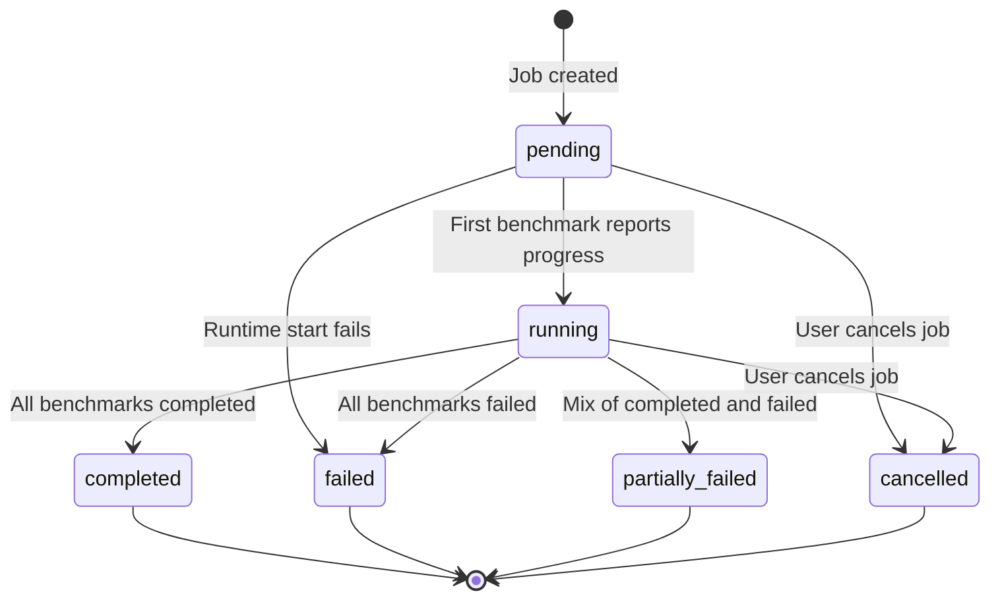

import { Tabs, TabItem } from '@astrojs/starlight/components';

Every [evaluation job](https://eval-hub.github.io/eval-hub/#tag/Evaluations/operation/post_evaluations_jobs) (`POST /api/v1/evaluations/jobs`) runs one or more benchmarks. EvalHub tracks state at two levels:

- **Benchmark state** — the status of each individual benchmark within the job.
- **Overall job state** — a single aggregate value derived from the states of all benchmarks.

The overall state is not set directly; it is recomputed every time a benchmark reports a status update.

## Lifecycle overview



## Benchmark states

Each benchmark within a job has its own state. Adapters report state changes by posting status events to the server via the [SDK callbacks interface](/guides/bring-your-own-framework/).

| State | Terminal | Description |
|-------|----------|-------------|
| `pending` | No | Initial state; benchmark has not started |
| `running` | No | Adapter is processing the benchmark |
| `completed` | Yes | Benchmark finished successfully |
| `failed` | Yes | Benchmark encountered an error |
| `cancelled` | Yes | Set when the job is cancelled; adapters cannot report this state via events |

Once a benchmark reaches a terminal state, subsequent non-terminal status events for that benchmark are rejected.

### Job phases

Within the `running` state, adapters can optionally report a finer-grained **phase** to indicate progress. Phases are informational and do not affect the overall job state.

| Phase | Description |
|-------|-------------|
| `initializing` | Adapter is setting up |
| `loading_data` | Loading evaluation data |
| `running_evaluation` | Executing the benchmark |
| `post_processing` | Processing results |
| `persisting_artifacts` | Saving outputs (e.g. to MLflow) |
| `completed` | Benchmark processing finished |

## Overall job states

The overall state is recomputed from the combination of all benchmark states every time a benchmark status update is received.

| State | Terminal | Description |
|-------|----------|-------------|
| `pending` | No | No benchmarks have reported progress yet |
| `running` | No | At least one benchmark has reported a state |
| `completed` | Yes | All benchmarks completed successfully |
| `failed` | Yes | All benchmarks failed |
| `partially_failed` | Yes | All benchmarks are terminal, but with a mix of completed and failed |
| `cancelled` | Yes | Job was cancelled by the user |

### Aggregation rules

The overall state is determined by counting benchmark outcomes. Given `total` benchmarks:

| Condition | Overall state |
|-----------|---------------|
| All completed | `completed` |
| All failed | `failed` |
| All completed or failed (mixed) | `partially_failed` |
| At least one has reported a state | `running` |
| No benchmarks have reported yet | `pending` |

:::note
These rules are evaluated in order. For example, a job with 3 benchmarks where 2 completed and 1 failed becomes `partially_failed`, not `failed`. The `cancelled` overall state is only set by explicit user cancellation (see [Cancellation](#cancellation)), not by aggregation.
:::

### Terminal state immutability

Once the overall job state reaches a terminal value (`completed`, `failed`, `partially_failed`, or `cancelled`), no further status updates are accepted. The API returns an error if an adapter attempts to update a benchmark on a terminal job.

## Cancellation

Cancel a job by sending `DELETE /api/v1/evaluations/jobs/{id}`. This:

1. Stops the runtime resources (Kubernetes Jobs or local processes).
2. Sets all non-terminal benchmarks to `cancelled`.
3. Sets the overall state to `cancelled`.

:::caution
Cancellation forces the overall state to `cancelled` regardless of individual benchmark outcomes. Even if some benchmarks already completed, the overall state will be `cancelled`, not `partially_failed`.
:::

## Deleting a job

To permanently remove a job record from storage, use the `hard_delete` query parameter:

```
DELETE /api/v1/evaluations/jobs/{id}?hard_delete=true
```

Unlike cancellation, this does not set any state — it deletes the job entirely. The job will no longer appear in list or get responses.

## Retries

EvalHub does not automatically retry failed benchmarks or jobs. On Kubernetes, backing Jobs are created with `backoffLimit: 0` and pods use `restartPolicy: Never`. To re-run a failed evaluation, submit a new job.

## Checking job status

<Tabs>
<TabItem label="REST API">

```bash
# Get a specific job (includes status and results)
curl -s "$EVALHUB_URL/api/v1/evaluations/jobs/$JOB_ID" | jq .
```

```bash
# List jobs filtered by status
curl -s "$EVALHUB_URL/api/v1/evaluations/jobs?status=failed" | jq .
```

</TabItem>
<TabItem label="CLI">

```bash
# Check status of a specific job
evalhub eval status $JOB_ID

# Watch status until the job completes
evalhub eval status $JOB_ID --watch
```

</TabItem>
<TabItem label="Python SDK">

```python
from evalhub import SyncEvalHubClient

with SyncEvalHubClient(base_url="http://localhost:8080") as client:
    job = client.jobs.get(job_id)

    print(job.status.state)          # e.g. "running"
    for b in job.status.benchmarks:
        print(f"  {b.id}: {b.status} (phase: {b.phase})")
```

</TabItem>
</Tabs>

### API response structure

The `status` field in the job response contains the overall state and per-benchmark details:

```json
{
  "status": {
    "state": "running",
    "message": {
      "message": "Evaluation job is running",
      "message_code": "evaluation_job_updated",
      "message_origin": "server"
    },
    "benchmarks": [
      {
        "provider_id": "lighteval",
        "id": "hellaswag",
        "benchmark_index": 0,
        "status": "completed",
        "phase": "completed",
        "started_at": "2026-08-17T12:00:00Z",
        "completed_at": "2026-08-17T12:05:30Z"
      },
      {
        "provider_id": "lighteval",
        "id": "mmlu",
        "benchmark_index": 1,
        "status": "running",
        "phase": "running_evaluation",
        "started_at": "2026-08-17T12:00:00Z"
      }
    ]
  }
}
```

## Kubernetes signals

On Kubernetes, EvalHub propagates lifecycle state through native Kubernetes primitives (labels, events, and annotations) on the backing Job for each benchmark. This enables cluster automation without polling the EvalHub API.

For details, see [Evaluation Lifecycle Signals](/kubernetes/lifecycle-signals/) and [Evaluation Event Violations](/kubernetes/event-violations/).
