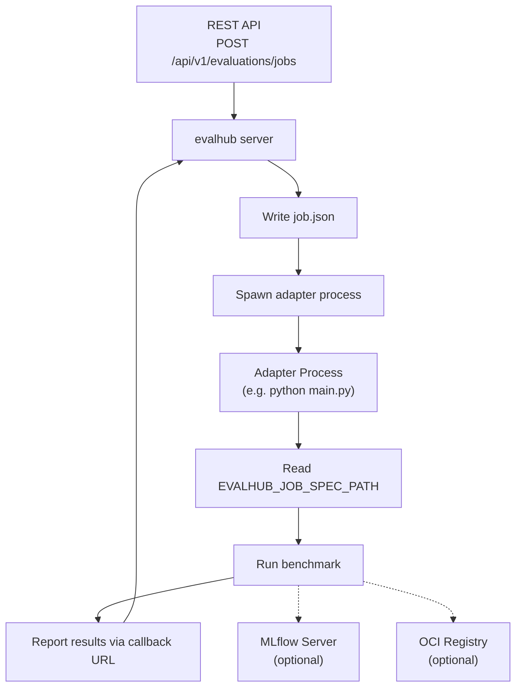

import Since from '../../../components/Since.astro';

<Since version="0.4.3 eval-hub-sdk" />

Local mode runs the full EvalHub evaluation pipeline on your workstation without a Kubernetes cluster. The REST API is identical to cluster mode — the same endpoints, request bodies, and response schemas apply.

Local mode is useful for:

- Developing and testing evaluation adapters before deploying to a cluster
- Running evaluations against locally-served models (Ollama, llama.cpp, vLLM)
- Iterating on benchmark configurations without infrastructure overhead
- Debugging the end-to-end evaluation flow

For a hands-on walkthrough, see the [Local Mode Tutorial](/guides/local-mode-tutorial/).

## Starting the Server in Local Mode

Install the SDK with the `server` and `cli` extras:

```bash
pip install "eval-hub-sdk[server,cli]"
```

Create a server configuration file (e.g. `my-config.yaml`):

```yaml
service:
  port: 8080

database:
  driver: sqlite
  url: file::eval_hub:?mode=memory&cache=shared

mlflow:
  tracking_uri: http://localhost:5000
```

Set the configuration and start the server:

```bash
evalhub config set server_config_file my-config.yaml
evalhub server start
```

```text
Server started (PID 12345).
  URL:  http://localhost:8080
  Logs: ~/.config/evalhub/server/server.log
```

Stop the server when you're done:

```bash
evalhub server stop
```

The server runs evaluation jobs as subprocesses in local mode. Authentication is disabled and CORS is enabled automatically.

:::note[MLflow tracking URI]
The MLflow tracking URI appears in two places with distinct purposes:

- **Server config YAML** (`mlflow.tracking_uri`) — tells the EvalHub server where MLflow is, so it can create experiments and link evaluation results to MLflow runs.
- **Provider YAML** (`runtime.local.env`) — passed to the adapter subprocess as the `MLFLOW_TRACKING_URI` environment variable, so the adapter can log metrics and artifacts to MLflow directly.

Both should point to the same MLflow instance.
:::

For full details on `evalhub server` commands, see the [CLI guide — "I want to manage the local server"](/guides/cli/#i-want-to-manage-the-local-server).

## Differences from Cluster Mode

| Aspect | Cluster mode | Local mode |
|---|---|---|
| **Job execution** | Kubernetes Jobs (containers) | Host subprocesses (`sh -c "<command>"`) |
| **Authentication** | Enabled (configurable) | Disabled automatically |
| **Multi-tenancy** | Tenant isolation via `X-Tenant` header | Single-tenant only |
| **CORS** | Disabled by default | Enabled |
| **Sidecar proxy** | Injected into job pods | Not used; adapters call services directly |
| **Init container** | Downloads test data to `/test_data` | Not used |
| **Job scheduling (Kueue)** | Supported via `queue` config | Ignored |
| **Process isolation** | Container sandbox per job | Shared host environment |
| **Provider runtime config** | `runtime.k8s` (image, entrypoint, resources) | `runtime.local` (command, env vars) |

## How Local Job Execution Works

When an evaluation job is submitted in local mode, for each benchmark the server:

1. Writes a **job specification** (`job.json`) to `/tmp/evalhub-jobs/<job_id>/<benchmark_index>/<provider_id>/<benchmark_id>/meta/`
2. Spawns the provider's `runtime.local.command` as a shell process, passing the job spec path via the `EVALHUB_JOB_SPEC_PATH` environment variable
3. Captures stdout/stderr to `jobrun.log` alongside the job spec
4. Tracks subprocess PIDs for cancellation (kills the entire process group on cancel)
5. The adapter reads the job spec, runs the benchmark, and reports results back via the callback URL



### Job file layout

```text
/tmp/evalhub-jobs/
└── <job_id>/
    └── <benchmark_index>/
        └── <provider_id>/
            └── <benchmark_id>/
                ├── meta/
                │   └── job.json        # Job specification for the adapter
                └── jobrun.log          # Stdout/stderr from the adapter process
```

## Provider Configuration for Local Mode

Each provider must have a `runtime.local` section specifying the adapter command and optional environment variables. The `runtime.local.command` is executed via `sh -c "<command>"`.

```yaml
name: my-provider
title: My Provider
description: My BYOF
runtime:
  local:
    command: "python main.py"
    env:
      - name: MLFLOW_TRACKING_URI
        value: http://localhost:5000
      - name: OCI_INSECURE
        value: "true"
benchmarks:
  - id: my-benchmark
    name: My Benchmark
    description: |-
      Mock evaluation benchmark with accuracy and exact_match metrics.
    category: general
    metrics:
      - accuracy
      - exact_match
    num_few_shot: 0
    dataset_size: 500
    tags:
      - general
      - custom
      - byof
    primary_score:
      metric: accuracy
      lower_is_better: false
    pass_criteria:
      threshold: 0.25
```

The `OCI_INSECURE` variable allows pushing artifacts to a local OCI registry running without TLS. For registries that require authentication, the OCI persister reads credentials from `~/.docker/config.json` — run `docker login` (or `podman login`) before starting an evaluation.

A provider configuration can include both `runtime.local` and `runtime.k8s` sections, allowing the same definition to work in both modes.

:::tip[Registering providers]
Register providers with `evalhub providers create --file <file>.yaml` after the server is running. See the [Local Mode Tutorial](/guides/local-mode-tutorial/) for a complete example.
:::

## Running an Evaluation

Once the server is running and a provider is registered, submit a job using a config file or CLI flags. Here is a sample `job.yaml`:

```yaml
name: my-job
model:
  url: http://localhost:11434/v1
  name: llama3.2:3b-instruct-q4_K_M
benchmarks:
  - id: my-benchmark
    provider_id: <provider-id>
    parameters:
      num_examples: 10
      num_few_shot: 0
experiment:
  name: my-experiment
exports:
  oci:
    coordinates:
      oci_host: localhost:5001
      oci_repository: myorg/eval-results
```

Replace `<provider-id>` with the ID returned by `evalhub providers create`. The `experiment` and `exports` sections are optional — omit them if you are not using MLflow or an OCI registry.

```bash
evalhub eval run --config job.yaml --wait
```

See the [CLI guide](/guides/cli/#i-want-to-run-an-evaluation) for the full set of `eval run` options, including inline flags and output formats.

## Writing Adapters for Both Modes

Adapters that need to work in both cluster and local mode should use a common pattern for resolving the output directory. In cluster mode the adapter writes results relative to its own directory; in local mode the job base path is available and results go under it:

```python
if self.local_jobs_base_path is not None:
    output_dir = self.local_jobs_base_path / "results"
else:
    output_dir = Path(__file__).parent / "results"
```

See the [LightEval adapter source](https://github.com/eval-hub/eval-hub-contrib/blob/main/adapters/lighteval/main.py) for a working example.

## Troubleshooting

### Adapter process logs

Check the adapter process output in the job log file:

```bash
cat /tmp/evalhub-jobs/<job_id>/<benchmark_index>/<provider_id>/<benchmark_id>/jobrun.log
```

### Server logs

The server log file is managed by `evalhub server` and stored at `~/.config/evalhub/server/server.log`. Check its location with:

```bash
evalhub server status
```

Look for `local runtime` messages in the log:

- `local runtime job spec written` — job spec was created successfully
- `local runtime process started` — adapter process was launched with the logged PID and command
- `local runtime benchmark launch failed` — adapter command failed to start

### Common issues

| Symptom | Cause | Fix |
|---|---|---|
| Job fails immediately | Adapter command not found | Verify `runtime.local.command` path and that dependencies are installed |
| Job stays in `running` state | Adapter is not reporting back | Check the adapter logs in `jobrun.log`; verify the callback URL is reachable |
| `provider has no local runtime configured` | Missing `runtime.local` in provider YAML | Add a `runtime.local.command` to the provider configuration |
| MLflow experiment not created | MLflow not configured | Set `mlflow.tracking_uri` in the server config YAML (`server_config_file`) |
| OCI push fails | Registry not reachable or requires auth | Verify the registry is running; run `docker login`/`podman login` for authenticated registries or set `OCI_INSECURE=true` for local ones |
