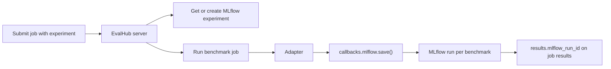

import { Tabs, TabItem } from '@astrojs/starlight/components';

EvalHub uses [MLflow](https://mlflow.org/) for optional experiment tracking. When a job includes an `experiment` block, the EvalHub server creates (or reuses) an MLflow experiment, and framework adapters log metrics, parameters, tags, and optional artifacts into MLflow runs.

MLflow support spans all three EvalHub components:

| Component | Role |
|-----------|------|
| [eval-hub](https://github.com/eval-hub/eval-hub) | Creates/resolves experiments on job submit; job sidecar proxies MLflow REST/artifact traffic |
| [eval-hub-sdk](https://github.com/eval-hub/eval-hub-sdk) | Adapter `callbacks.mlflow.save()` client (`odh` or `upstream` backend); job `ExperimentConfig` models |
| [eval-hub-contrib](https://github.com/eval-hub/eval-hub-contrib) | Adapters call `callbacks.mlflow.save()` after evaluation; CLEAR can also **fetch** agent traces from MLflow |

For a hands-on local walkthrough, see the [Local Mode Tutorial](/guides/local-mode-tutorial/). For short CLI/SDK/API examples, see [Quick Start — Use MLflow Tracking](/getting-started/quickstart/#use-mlflow-tracking).

## How tracking works



1. **Job submit** — If `experiment.name` is set, the server requires a configured MLflow tracking URI. It gets or creates the experiment (with your tags plus EvalHub metadata tags) and stores `mlflow_experiment_id` / `mlflow_experiment_url` on the job.
2. **Job runtime** — Each benchmark receives `experiment_name` (and tags) in the JobSpec. Adapters that support tracking call `callbacks.mlflow.save(results, job_spec, artifacts=...)`.
3. **Runs** — The SDK creates **one MLflow run per benchmark**, named `{job_id}_{benchmark_index}`. Metrics and params are logged in that run; optional file artifacts (JSON/HTML reports) can be uploaded too.
4. **Results** — Adapters assign the returned run id to `results.mlflow_run_id` before `report_results()`, so the EvalHub API surfaces it on benchmark results.

Without `experiment.name`, adapters skip MLflow logging (no error).

:::note[Kubernetes vs local]
In **cluster mode**, adapters set `MLFLOW_TRACKING_URI` to the **job sidecar** base URL. The sidecar proxies `/api/2.0/mlflow`, `/api/3.0/mlflow`, and `/api/2.0/mlflow-artifacts` to the real tracking server and injects auth.

In **local mode**, the adapter talks to MLflow directly. Set the same URI in the [server config](#server-configuration) and in the provider’s `runtime.local.env` as `MLFLOW_TRACKING_URI`. See [Local Mode](/guides/local-mode/#starting-the-server-in-local-mode).
:::

## Server configuration

Enable tracking by setting `mlflow.tracking_uri` (or `MLFLOW_TRACKING_URI`). Other fields are optional.

```yaml
mlflow:
  tracking_uri: http://localhost:5000
  # http_timeout: 30s
  # ca_cert_path: /path/to/ca.crt
  # insecure_skip_verify: false
  # token: ""                    # static bearer token (prefer token_path in production)
  # token_path: /var/run/secrets/mlflow/token
  # workspace: default           # X-MLFLOW-WORKSPACE when the server supports workspaces
```

| Setting | Env var | Description |
|---------|---------|-------------|
| `mlflow.tracking_uri` | `MLFLOW_TRACKING_URI` | MLflow tracking server URL (required to use experiments) |
| `mlflow.http_timeout` | — | HTTP client timeout |
| `mlflow.ca_cert_path` | `MLFLOW_CA_CERT_PATH` | Custom CA bundle for TLS |
| `mlflow.insecure_skip_verify` | `MLFLOW_INSECURE_SKIP_VERIFY` | Skip TLS verification |
| `mlflow.token` | — | Static bearer token |
| `mlflow.token_path` | `MLFLOW_TOKEN_PATH` | Path to a token file (takes precedence over static token at runtime) |
| `mlflow.workspace` | `MLFLOW_WORKSPACE` | Workspace name for multi-tenant / Open Data Hub–style MLflow; ignored if the server has no workspace support |

On OpenShift, the TrustyAI operator typically injects `MLFLOW_TRACKING_URI` into the EvalHub deployment. Job pods also receive `MLFLOW_WORKSPACE` set to the **tenant namespace** so kubernetes-auth SAR checks run in the correct namespace. See [Tenancy](/architecture/tenancy/).

Submitting a job with `experiment` when MLflow is not configured returns an error: *MLflow is required for experiment tracking*.

## Experiment configuration on jobs

### Schema

REST API and Python SDK use the same shape (`ExperimentConfig`):

| Field | Type | Description |
|-------|------|-------------|
| `name` | string | MLflow experiment name (required to enable tracking) |
| `tags` | array of `{key, value}` | Up to 20 tags; keys ≤250 bytes, values ≤5000 bytes |
| `artifact_location` | string | Optional artifact store location when creating a new experiment |

The MCP `submit_evaluation` tool accepts `tags` as a **string map** and converts it to `{key, value}` pairs before calling the API.

EvalHub also injects experiment tags on create:

| Tag key | Value |
|---------|-------|
| `context` | `eval-hub` |
| `evaluation_job_name` | Job `name` (when set) |
| `evaluation_job_description` | Job `description` (when set) |
| `evaluation_job_id` | Job id |

### Examples

<Tabs syncKey="interface">
<TabItem label="CLI">

```bash
evalhub eval run \
  --name llama3-mlflow-eval \
  --model-url http://localhost:11434/v1 \
  --model-name qwen2.5:1.5b \
  --provider lm_evaluation_harness \
  --benchmark mmlu \
  --experiment my-experiment
```

Use a job YAML for tags and `artifact_location`:

```yaml
name: llama3-mlflow-eval
model:
  url: http://localhost:11434/v1
  name: qwen2.5:1.5b
benchmarks:
  - id: mmlu
    provider_id: lm_evaluation_harness
experiment:
  name: my-experiment
  tags:
    - key: environment
      value: testing
    - key: model_family
      value: qwen2.5
```

</TabItem>
<TabItem label="Python SDK">

```python
from evalhub.models.api import (
    BenchmarkConfig,
    ExperimentConfig,
    ExperimentTag,
    JobSubmissionRequest,
    ModelConfig,
)

job = client.jobs.submit(JobSubmissionRequest(
    name="llama3-mlflow-eval",
    model=ModelConfig(url="http://localhost:11434/v1", name="qwen2.5:1.5b"),
    benchmarks=[BenchmarkConfig(id="mmlu", provider_id="lm_evaluation_harness")],
    experiment=ExperimentConfig(
        name="my-experiment",
        tags=[
            ExperimentTag(key="environment", value="testing"),
            ExperimentTag(key="model_family", value="qwen2.5"),
        ],
    ),
))
```

</TabItem>
<TabItem label="REST API">

```bash
curl -s -X POST "$EVALHUB_URL/api/v1/evaluations/jobs" \
  -H "Content-Type: application/json" \
  -d '{
    "name": "llama3-mlflow-eval",
    "model": {
      "url": "http://localhost:11434/v1",
      "name": "qwen2.5:1.5b"
    },
    "benchmarks": [
      {
        "id": "mmlu",
        "provider_id": "lm_evaluation_harness"
      }
    ],
    "experiment": {
      "name": "my-experiment",
      "tags": [
        {"key": "environment", "value": "testing"},
        {"key": "model_family", "value": "qwen2.5"}
      ]
    }
  }'
```

</TabItem>
</Tabs>

## What gets logged

For each benchmark run, the SDK logs:

| Kind | Contents |
|------|----------|
| **Params** | `benchmark_id`, `provider_id`, `model_name`, `num_examples_evaluated`, `duration_seconds`, plus selected EvalCard fields when present |
| **Metrics** | Each `EvaluationResult` metric (keys sanitized for the MLflow REST API, e.g. commas → `_`) and `overall_score` when set |
| **Tags** | JobSpec experiment tags on the run |
| **Artifacts** | Optional adapter-supplied files (`MlflowArtifact`), e.g. JSON summaries or HTML dashboards |

Job status / results include:

- `mlflow_experiment_id` / `mlflow_experiment_url` on the job (when an experiment was resolved)
- `mlflow_run_id` on each completed benchmark result (when the adapter saved a run)

## Adapter SDK backends

Adapters use `callbacks.mlflow.save()`. The backend is selected with `EVALHUB_MLFLOW_BACKEND`:

| Value | Behavior |
|-------|----------|
| `odh` (default) | Lightweight built-in REST client in the SDK (`evalhub.adapter.mlflow.MlflowClient`); no extra `mlflow` package required |
| `upstream` | Official `mlflow` / `mlflow-skinny` Python library; install it in the adapter image |

Typical adapter pattern (see [system overview](/architecture/system-overview/) and contrib adapters such as LightEval):

```python
from evalhub.adapter.mlflow import MlflowArtifact

run_id = callbacks.mlflow.save(
    results,
    adapter.job_spec,
    artifacts=[
        MlflowArtifact("results.json", json_bytes, "application/json"),
    ],
)
if run_id:
    results.mlflow_run_id = run_id

callbacks.report_results(results)
```

`save()` is a no-op (returns `None`) when `job_spec.experiment_name` is unset. On failure it reports a status event with `message_code=mlflow_save_failed` and raises.

Environment variables used by the SDK client include `MLFLOW_TRACKING_URI`, `MLFLOW_TRACKING_TOKEN` / `MLFLOW_TRACKING_TOKEN_PATH`, `MLFLOW_WORKSPACE`, and TLS helpers such as `MLFLOW_TRACKING_INSECURE_TLS` / `MLFLOW_TRACKING_SERVER_CERT_PATH`.

## CLEAR: traces in, results out

The [IBM CLEAR adapter](/adapters/clear/) uses MLflow in two different ways:

| Purpose | Configuration |
|---------|----------------|
| **Fetch input traces** | `parameters.mlflow_traces_experiment_name` or `parameters.mlflow_traces_experiment_id` (optional `mlflow_traces_filter`, `mlflow_traces_run_id`, `mlflow_traces_max_results`) plus `MLFLOW_TRACKING_URI` |
| **Upload CLEAR results** | Job `experiment.name` (or JobSpec `experiment_name` / `parameters.mlflow_experiment_name`) — uploads `clear_results.json`, summaries, and HTML when present |

Those two experiments can be the same or different. See the [CLEAR adapter](https://github.com/eval-hub/eval-hub-contrib/tree/main/adapters/clear) README for full details.

## Troubleshooting

| Symptom | Likely cause | Fix |
|---------|--------------|-----|
| Job submit rejects `experiment` | MLflow not configured on the server | Set `mlflow.tracking_uri` / `MLFLOW_TRACKING_URI` |
| No experiment / no runs in the UI | Job omitted `experiment.name`, or adapter skipped save | Pass `--experiment` / `experiment.name`; confirm the adapter calls `callbacks.mlflow.save()` |
| Local adapter cannot reach MLflow | Provider env missing tracking URI | Set `MLFLOW_TRACKING_URI` in `runtime.local.env` to the same server as the EvalHub config |
| Cluster adapter auth / TLS errors | Sidecar or CA misconfigured | Confirm MLflow is reachable from the cluster; check service CA / token mounts documented in architecture diagrams |
| Metric keys rejected by MLflow | Unusual characters in metric names | The SDK sanitizes keys for logging; raw names remain unchanged in EvalHub `JobResults` |
| Workspace / 403 on OpenShift | Tenant RBAC or workspace header | Ensure job SA has MLflow experiment permissions; see [multi-tenancy](/architecture/multi-tenancy/) and [single-tenancy](/architecture/single-tenancy/) |

## Related

- [Local Mode](/guides/local-mode/) — dual URI setup for server vs adapter
- [Local Mode Tutorial](/guides/local-mode-tutorial/) — start MLflow and run an evaluation with `--experiment`
- [Server API](/reference/server-api/) — configuration reference
- [MCP tools — submit_evaluation](/mcp/tools/#tool-submit_evaluation) — experiment fields for agents
- Upstream notes: [eval-hub MLFLOW.md](https://github.com/eval-hub/eval-hub/blob/main/MLFLOW.md) (developer-oriented; prefer this guide for current behavior)
